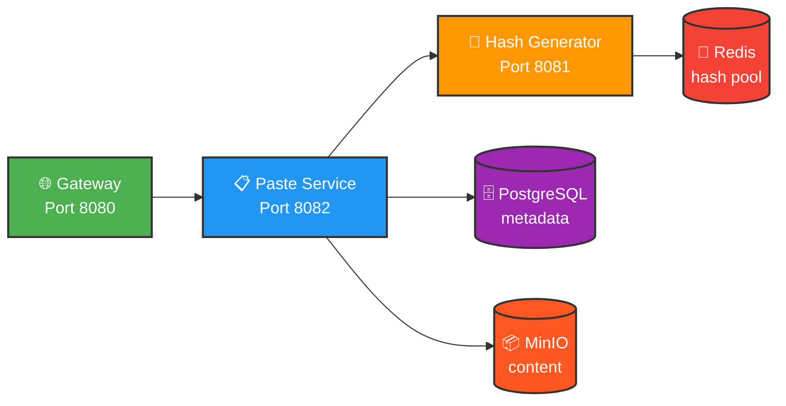

# 📋 Pastebin System

Distributed Pastebin Service built with Spring Boot Microservices Architecture.


---

## 🏗 Architecture (v2.0)


### Storage Strategy

| Data Type | Storage | Rationale |
|-----------|---------|-----------|
| **Metadata** (hash, blobKey, expiresAt) | PostgreSQL | Fast queries, indexes, TTL |
| **Content** (paste text) | MinIO (S3) | Scalable blob storage |
| **Hash Pool** (pre-generated IDs) | Redis | ~1ms retrieval time |

---

## 👥 User Flow
### Share Text with Expiration
```
┌─────────────┐                              ┌─────────────┐
│  User A     │                              │  User B     │
│             │                              │             │
│  1. Create  │                              │             │
│  paste with │                              │             │
│  expiration │                              │             │
│     │       │                              │             │
│     ▼       │                              │             │
│  2. Get     │                              │             │
│  shareable  │────── Send Link ────────────►│  4. Open    │
│  link       │     http://.../pastes/abc123 │     link    │
│             │                              │             │
│             │         ⏰ Time passes       │             │
│             │                              │             │
│             │                              │  5. Link    │
│             │                              │  expired    │
│             │                              │  (410 Gone) │
└─────────────┘                              └─────────────┘
```

## 📦 Modules

| Module | Port | Description |
|--------|------|-------------|
| **pastebin-gateway** | 8080 | API Gateway - routing, rate limiting |
| **paste-service** | 8082 | Main service - CRUD operations for pastes |
| **hash-generator-service** | 8081 | Hash generation with Redis |
| **pastebin-common** | — | Shared DTOs, utils, exceptions |

---

## 🔌 API Endpoints

### Paste Service (Port 8082)

| Method | Endpoint | Description | Status |
|--------|----------|-------------|--------|
| `POST` | `/api/pastes` | Create new paste | ✅ Implemented |
| `GET` | `/api/pastes/{hash}` | Get paste by hash | ✅ Implemented |
| `DELETE` | `/api/pastes/{hash}` | Delete paste | ✅ Implemented |

### Hash Generator Service (Port 8081)

| Method | Endpoint | Description | Status |
|--------|----------|-------------|--------|
| `GET` | `/api/hash?length=8` | Get unique hash from Redis pool | ✅ Implemented |

**Example:**
``` bash
curl http://localhost:8081/api/hash?length=8
# Response: cHjj6PzH
```

### Health Check

| Method | Endpoint | Description | Status |
|--------|----------|-------------|--------|
| `GET` | `/health` | Service health status | ✅ Implemented |


## 🚀 Quick Start

### Prerequisites

- Java 21+
- Maven 3.8+
- Docker & Docker Compose

### 1. Clone Repository

```bash
git clone https://github.com/EternalEffy/pastebin-system.git
cd pastebin-system
```
### 2. Build Project
```bash
mvn clean install
```
### 3. Start Infrastructure
```bash
docker-compose up -d
```
### 4. Test API
```bash
# Create paste
curl -X POST http://localhost:8080/api/pastes \
  -H "Content-Type: application/json" \
  -d '{"content":"Hello World"}'

# Get paste
curl http://localhost:8080/api/pastes/{hash}

# Check Redis hash pool
docker-compose exec redis redis-cli LLEN hash:pool

# Check MinIO content
docker-compose exec minio mc alias set myminio http://localhost:9000 minioadmin minioadmin
docker-compose exec minio mc ls myminio/pastes/
```
## 🔴 Redis Hash Pool

The hash-generator-service uses a **pre-generated hash pool** for high performance:

| Parameter | Value | Description |
|-----------|-------|-------------|
| **Pool Key** | `hash:pool` | Redis List storing hashes |
| **Threshold** | 100 | Refill when pool < 100 |
| **Batch Size** | 1000 | Hashes per refill |
| **Refill Interval** | 5s | Background job frequency |
| **Hash Length** | 8 | Characters per hash |

**Benefits:**
- ⚡ Fast hash generation (~1ms vs ~50ms for on-demand)
- 🔄 Automatic pool replenishment
- 📊 Monitor pool size: `docker-compose exec redis redis-cli LLEN hash:pool`

---

## 📦 MinIO Blob Storage

Paste content is stored in MinIO (S3-compatible object storage):

| Parameter | Value | Description |
|-----------|-------|-------------|
| **Bucket** | `pastes` | All paste content |
| **Key Format** | `pastes/{hash}` | Unique key per paste |
| **Content Type** | `text/plain` | Plain text storage |
| **Console** | `http://localhost:9001` | Web UI for browsing |

**Benefits:**
- 📈 Scalable content storage (~1M+ pastes)
- 💾 Separation from metadata (PostgreSQL)
- 🔄 Easy migration to AWS S3 if needed

---

## 📦 Tech Stack

| Category | Technology |
|--------|-------------|
| **Language** | Java 21 |
| **Framework** | Spring Boot 3.3.0 |
| **Database** | PostgreSQL 15 |
| **Cache** | Redis 7 |
| **Blob Storage** | MinIO (S3-compatible) |
| **Build Tool** | Maven |
| **Architecture** | Microservices (REST) |
