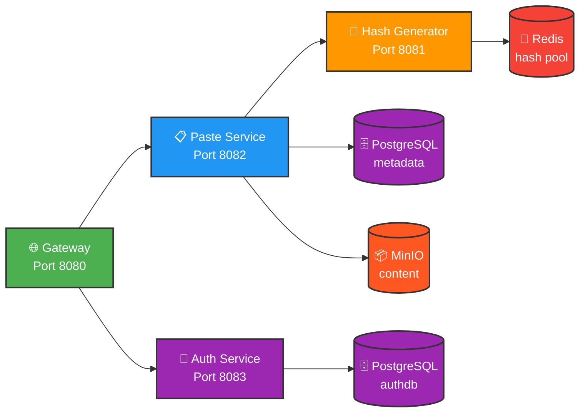

# 📋 Pastebin System

Distributed Pastebin Service built with Spring Boot Microservices Architecture.


---

## 🏗 Architecture (v2.0)


### Storage Strategy

| Data Type | Storage | Rationale |
|-----------|---------|-----------|
| **Metadata** (hash, blobKey, expiresAt) | PostgreSQL | Fast queries, indexes, TTL |
| **Content** (paste text) | MinIO (S3) | Scalable blob storage |
| **Hash Pool** (pre-generated IDs) | Redis | ~1ms retrieval time |

---

## 🔐 Authentication

### Overview

The system uses JWT-based authentication with access and refresh tokens.

| Token | Lifetime | Storage | Purpose |
|-------|----------|---------|---------|
| Access Token | 15 minutes | Client memory | API authorization |
| Refresh Token | 7 days | HttpOnly cookie / DB | Get new access token |

### Security

- Passwords hashed with BCrypt (cost factor 12)
- Refresh tokens hashed with SHA-256 before DB storage
- Token rotation on refresh (old token revoked)
- Token revocation on logout

### Example Usage

```bash
# 1. Login
curl -X POST http://localhost:8080/api/auth/login \
  -H "Content-Type: application/json" \
  -d '{"email":"user@example.com","password":"Password123"}'

# 2. Use access token
curl http://localhost:8080/api/pastes/my \
  -H "Authorization: Bearer <ACCESS_TOKEN>"

# 3. Refresh token
curl -X POST http://localhost:8080/api/auth/refresh \
  -H "Content-Type: application/json" \
  -d '{"refreshToken":"<REFRESH_TOKEN>"}'
```

## 👥 User Flow

### Authentication & Paste Operations


### Share Paste (Public)


## 📦 Modules

| Module | Port | Description |
|--------|------|-------------|
| **pastebin-gateway** | 8080 | API Gateway - routing, rate limiting |
| **pastebin-auth-service** | 8083 | JWT authentication (register, login, refresh, logout) |
| **paste-service** | 8082 | Main service - CRUD operations for pastes |
| **hash-generator-service** | 8081 | Hash generation with Redis |
| **pastebin-common** | — | Shared DTOs, utils, exceptions |

---

## 🔌 API Endpoints

### Auth Service (Port 8083)

| Method | Endpoint | Auth | Description |
|--------|----------|------|-------------|
| `POST` | `/api/auth/register` | No | Register new user |
| `POST` | `/api/auth/login` | No | Login and get JWT tokens |
| `POST` | `/api/auth/refresh` | No | Refresh access token |
| `POST` | `/api/auth/logout` | Yes | Logout and revoke tokens |

### Gateway (Port 8080)

| Method | Endpoint | Auth | Description |
|--------|----------|------|-------------|
| `POST` | `/api/pastes` | Yes | Create new paste |
| `GET` | `/api/pastes/{hash}` | Optional | Get paste by hash |
| `GET` | `/api/pastes/my` | Yes | Get your pastes |
| `DELETE` | `/api/pastes/{hash}` | Yes | Delete paste (owner only) |
| `GET` | `/api/hash?length=8` | Yes | Get unique hash from Redis |

### Paste Service (Port 8082)

| Method | Endpoint | Description 
|--------|----------|-------------
| `GET` | `/api/pastes/my` | Get your pastes |
| `POST` | `/api/pastes` | Create new paste |
| `GET` | `/api/pastes/{hash}` | Get paste by hash |
| `DELETE` | `/api/pastes/{hash}` | Delete paste |

### Hash Generator Service (Port 8081)

| Method | Endpoint | Description |
|--------|----------|-------------|
| `GET` | `/api/hash?length=8` | Get unique hash from Redis pool |

**Example:**
``` bash
curl http://localhost:8081/api/hash?length=8
# Response: cHjj6PzH
```

### Health Check

| Method | Endpoint | Description |
|--------|----------|-------------|
| `GET` | `/health` | Service health status |


## 🚀 Quick Start

### Prerequisites

- Java 21+
- Maven 3.8+
- Docker & Docker Compose

### 1. Clone Repository

```bash
git clone https://github.com/EternalEffy/pastebin-system.git
cd pastebin-system
```
### 2. Build Project
```bash
mvn clean install
```
### 3. Start Infrastructure
```bash
docker-compose up -d
```
## 🔴 Redis Hash Pool

The hash-generator-service uses a **pre-generated hash pool** for high performance:

| Parameter | Value | Description |
|-----------|-------|-------------|
| **Pool Key** | `hash:pool` | Redis List storing hashes |
| **Threshold** | 100 | Refill when pool < 100 |
| **Batch Size** | 1000 | Hashes per refill |
| **Refill Interval** | 5s | Background job frequency |
| **Hash Length** | 8 | Characters per hash |

**Benefits:**
- ⚡ Fast hash generation (~1ms vs ~50ms for on-demand)
- 🔄 Automatic pool replenishment

---

## 📦 MinIO Blob Storage

Paste content is stored in MinIO (S3-compatible object storage):

| Parameter | Value | Description |
|-----------|-------|-------------|
| **Bucket** | `pastes` | All paste content |
| **Key Format** | `pastes/{hash}` | Unique key per paste |
| **Content Type** | `text/plain` | Plain text storage |
| **Console** | `http://localhost:9001` | Web UI for browsing |

**Benefits:**
- 📈 Scalable content storage (~1M+ pastes)
- 💾 Separation from metadata (PostgreSQL)
- 🔄 Easy migration to AWS S3 if needed

---

## 📦 Tech Stack

| Category | Technology |
|--------|-------------|
| **Language** | Java 21 |
| **Framework** | Spring Boot 3.3.0 |
| **Database** | PostgreSQL 15 |
| **Cache** | Redis 7 |
| **Blob Storage** | MinIO (S3-compatible) |
| **Build Tool** | Maven |
| **Architecture** | Microservices (REST) |
