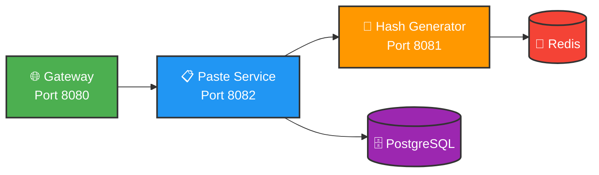

# 📋 Pastebin System

Distributed Pastebin Service built with Spring Boot Microservices Architecture.


---

## 🏗 Architecture


## Key Features

- Microservices Architecture — Independent deployment and scaling
- Redis Hash Pool — Pre-generated hashes for high performance (~1ms)
- Background Refill Job — Automatic pool replenishment (@Scheduled)
- API Gateway — Centralized routing and future rate limiting
- PostgreSQL — Persistent storage for paste content

## 📦 Modules

| Module | Port | Description |
|--------|------|-------------|
| **pastebin-gateway** | 8080 | API Gateway - routing, rate limiting |
| **paste-service** | 8082 | Main service - CRUD operations for pastes |
| **hash-generator-service** | 8081 | Hash generation with Redis |
| **pastebin-common** | — | Shared DTOs, utils, exceptions |

---

## 🚀 Quick Start

### Prerequisites

- Java 21+
- Maven 3.8+
- Docker & Docker Compose

### 1. Clone Repository

```bash
git clone https://github.com/EternalEffy/pastebin-system.git
cd pastebin-system
```
### 2. Build Project
```bash
mvn clean install
```
### 3. Start Infrastructure
```bash
docker-compose up -d
```
### 4. Run Services
```bash
# Run paste-service
mvn spring-boot:run -pl pastebin-service

# Run hash-generator-service
mvn spring-boot:run -pl hash-generator-service

# Run gateway
mvn spring-boot:run -pl pastebin-gateway
```
## 📦 Tech Stack
| Category | Technology |
|--------|-------------|
| **Language** | Java 21 |
| **Framework** | Spring Boot 3.3.0 |
| **Database** | PostgreSQL 15 |
| **Cache** | Redis 7 |
| **Build Tool** | Maven |
| **Architecture** | Microservices (REST) |

## 🔌 API Endpoints

### Hash Generator Service (Port 8081)

| Method | Endpoint | Description | Status |
|--------|----------|-------------|--------|
| `GET` | `/api/hash?length=8` | Get unique hash from Redis pool | ✅ Implemented |

**Example:**
``` bash
curl http://localhost:8081/api/hash?length=8
# Response: cHjj6PzH
```

### Paste Service (Port 8082)

| Method | Endpoint | Description | Status |
|--------|----------|-------------|--------|
| `POST` | `/api/pastes` | Create new paste | ✅ Implemented |
| `GET` | `/api/pastes/{hash}` | Get paste by hash | ✅ Implemented |
| `DELETE` | `/api/pastes/{hash}` | Delete paste | ✅ Implemented |

### Health Check

| Method | Endpoint | Description | Status |
|--------|----------|-------------|--------|
| `GET` | `/health` | Service health status | ✅ Implemented |
